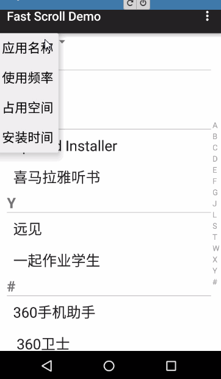

# SortRecyclerView
仿联系人A-Z排序的RecyclerView，随意添加对应的分类title

结合了 
https://github.com/code-computerlove/FastScrollRecyclerView

https://github.com/eowise/recyclerview-stickyheaders

用户第一次打开，要使用应用使用频率必须把跳转到设设置的权限打开，不然不能够获取应用的上次打开的时间

